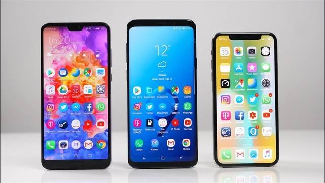
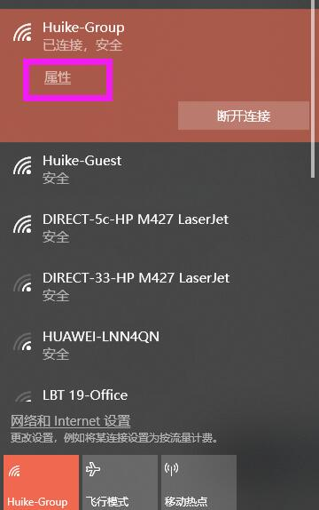
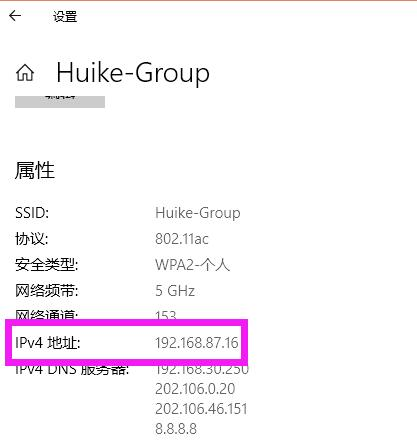
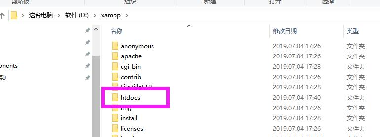
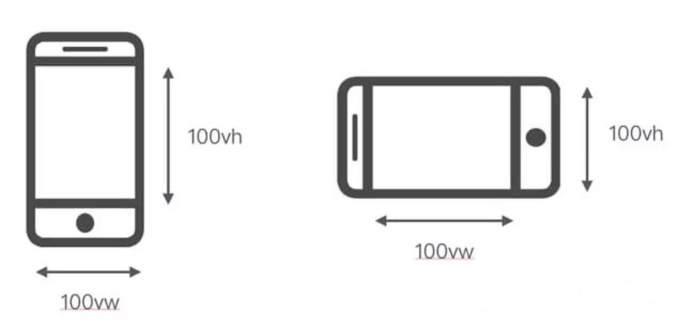
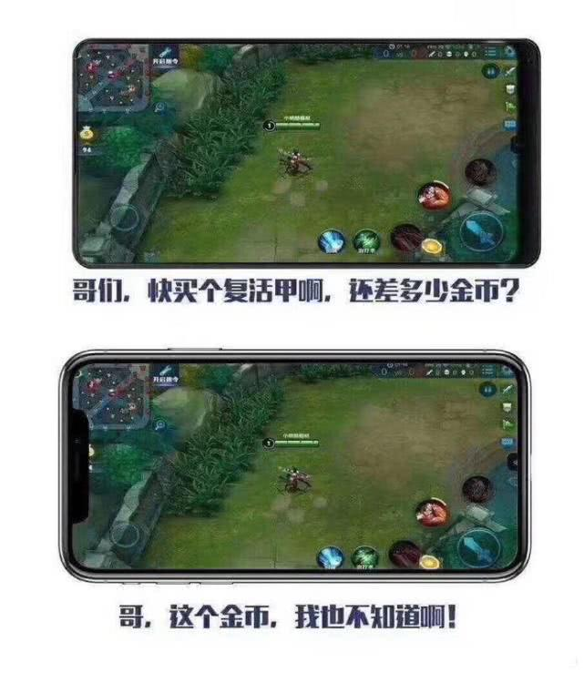
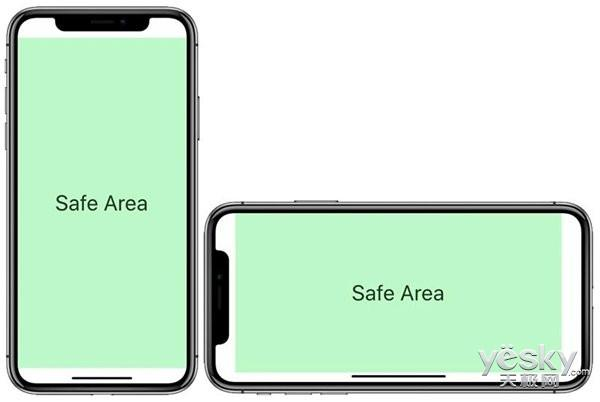

# 移动端布局

### 课前准备

---

掌握上一节课说到的：像素比、设备独立像素、物理像素等概念，了解rem适配原理


### 课堂主题

---

今天我们来填坑~ 走过路过不要错过啦~ 来看看移动端的坑吖~

不是一个，不是两个，而是一堆~


### 本节课知识点

---

#### 调试检查

模拟器可代替不了真机~ 起码肯定是模拟不出来刘海的~



所以呢~ 我们在制作网站的时候，可以把模拟器的状态作为参考，但是做完后，还是要通过真机检测，是否存在问题~ 那么如何检测把网站放到手机上进行检测呢？

**检测步骤**

1. 下载`XAMPP`：<https://sourceforge.net/projects/xampp/files/>
   但是下载起来，特别慢，如果自己下载，推荐使用迅雷（我下载它告诉我要一天！！），所以提供了安装包到课件。

   > `XAMPP`是一个集成了很多功能的软件，这里我们使用`Apache`模块，它是WEB服务器软件，功能是让别的设备在浏览器上输入它的地址时，它能把相应的网页文件、媒体文件发送给浏览器。`（注意连接同一个网络）`

1. 安装：打开

1. 找到`Apache`点击`start`开启服务

     

   **注意：**

   有的同学可能在这一步会发生错误，下面会提示这样的文字

   

     

   

   一般来说，产生原因是端口为其他程序占用，修改下端口就好，修改端口：

   > **httpd-ssl.conf 文件**
   >
   > ​	所有 443 => 444（自定义端口）
   >
   > **httpd.conf 文件**
   >
   > ​	所有 80=> 88（自定义端口）
   >
   > 关闭软件重新启动 

4. 找到防火墙，添加`Apache HTTP Server`允许使用专用 or 公用网络（否则还是会访问失败）

4. 保证 手机 和 电脑连接同一个网络

4. 找到当前电脑`IP`地址

     

4. 手机浏览器，输入`IP`地址

4. 这时我们就可以访问到页面啦~ 如果想要访问到自己写的页面，做如下操作

     

   把你想要查看的页面放到`htdocs`文件夹内，就可以看到啦~

   > 这里为了给大家展示效果，我下载了一个投屏软件：`AirServer`
   >
   > 但是对于大家开发来说，是没有什么实际用处的，所以并不需要下载，该软件针对苹果设备


**调试辅助工具**

`vConsole`是一个可以帮助我们在手机上进行调试的工具，我们可以通过它看html的结构以及`JS报错`等内容，使用方法如下：

1. 下载`vConsole`，地址：<https://raw.githubusercontent.com/Tencent/vConsole/dev/dist/vconsole.min.js>

2. 在需要使用的页面中，引入上面的`JS`文件

3. 添加代码

   ```js
   var vConsole = new VConsole();
   ```


4. 但是很可惜，没有办法看到元素的样式哦~


#### 适配方案

`rem` 适配代码：

```html
<script>
    var html = document.documentElement;
    var widths = html.clientWidth;
    var num = 10;
    html.style.fontSize = widths / num + 'px';
</script>
```

这是我们上节课已经说过的适配方案~ 但是呢，并不是所有人都会写`JS`的，有没有什么方案，我们可以不写`JS`

呢？还是真的有，我们来看下

**新的单位：`vw`、`vh`**

>兼容：IE9及以上，IOS 6.1+ ，安卓4.4+

这两个单位都是根据视口屏幕来进行计算的，所以PC的时候，要注意滚动条哦~

我们来看下，下面的图



注意哦：不管设备是横屏还是竖屏，`vw`指的都是水平方向的，`vh`指的都是垂直方向的

它和百分比不一样，不会受到父级宽度的影响，这样我们通过`css`就可以获取到当前的视口宽度了，利用**获取到的视口宽度 / 100vw **

```css
html{
    font-size: 10vw;
}
/* 因为整个屏幕是 100vw ，这里我们分成 10 个格子，一个格子是 10vw 的 font-size */
```

这样的话，因为屏幕的宽度发生变化，html 上的`font-size`也会动态发生变化

```css
div{
    width:5rem;
    height:5rem;
}
```

以上和我们原来写`JS`达到的效果是一样的，当然我们也可以直接用vw的单位，例如：

```css
div{
    width:50vw;
    height:50vw;
}
```

> 除了上面说到的 `vw` 和 `vh `以外，还有 `vmin`和 ` vmax`
>
> `vmin`：选取 `vw `和` vh` 中较小的
>
> `vmax`：选取 `vw`和 `vh` 中较大的

**当然，这个方案也不是十全十美的，因为在计算的过程中也会出现小数点**


#### 横竖屏适配

利用`JS`和`CSS`都可以做到，这里我们说下`CSS`怎么做

```css
@media screen and (orientation:portrait){
    #box{
        background: red;
    }
}
@media screen and (orientation:landscape){
    #box{
        background: green;
    }
}
```

- screen 屏幕
- orientation 方向
- portrait 竖向
- landscape 横向


#### 适配iPhoneX



`iphoneX`首先提出刘海屏概念的时候，打了所有软件一个措手不及，例如上面的王者荣耀，完全看不见金币有多少，也很难点击到，如果我对面有个`iphoneX`的对手，那简直就是福利局。

所以起初，我们如何适配`iphoneX`就是个很头疼的问题了。

不过毕竟iphoneX是个主流手机，为了更好的支持它，软件商纷纷拿出自己的方案，一直到现在，其实iphoneX的刘海在我们只做网站的时候，已经不会产生太大的影响了。

  

左侧：`iphoneX`，同事哒，所以没法给你们演示，只能截个图啦~ 有设备的同学自己可以试试

右侧：`vivo`，这个是微信的界面，可以看到，也遮挡不到我们的内容

所以对于移动端来说，顶部的适配，我们已经不需要去处理啦，但是底部以及左右两侧，我们就要考虑下了

**安全区**



上面这个图，就是我们的安全区，保证内容是在安全区内进行显示的，会比较好，不容易发生遮挡、显示不全等问题。


利用`iphoneX`专属样式`viewport-fit`属性，他会对网页设置安全区

```html
<meta name="viewport" content="viewport-fit=cover>
```

- cover 
- contain

**配合css方法**

```css
body{
    padding-bottom:constant(safe-area-inset-bottom);
    padding-bottom:env(safe-area-inset-bottom);
}
```

- constant：小于IOS11.2版本生效
- env：大于IOS11.2版本生效


可以看到下面出现了一块内容，这次黑色的这条线，就不会挡住我们的文字或其它内容了。

- safe-area-inset-lef 设置左侧安全区
- safe-area-inset-right 设置右侧安全区
- safe-area-inset-top 设置顶部安全区
- safe-area-inset-bottom 设置底部安全区


#### 1px适配方案

某些时候，设计人员希望 `1px`在手机显示的就是`1px`，这也是....闲的，但是我们也要满足他们的需求，

这时候我们可以利用缩放来达到目的

```css
.border_1px:before{
    content: '';
    position: absolute;
    top: 0;
    height: 1px;
    width: 100%;
    background-color: #000;
    transform-origin: 0% 0%;
}
@media only screen and (-webkit-min-device-pixel-ratio:2){
    .border_1px:before{
        transform: scaleY(0.5);
    }
}
@media only screen and (-webkit-min-device-pixel-ratio:3){
    .border_1px:before{
        transform: scaleY(0.33);
    }
}

```

设置一个专门的`class`来处理`1px`的问题，利用伪类给其添加

- -webkit-min-device-pixel-ratio 获取像素比
- transform: scaleY(0.5) 垂直方向缩放，后面的数字是倍数


#### 图片模糊问题

```css
.avatar{
    background-image: url(conardLi_1x.png);
}
@media only screen and (-webkit-min-device-pixel-ratio:2){
    .avatar{
        background-image: url(conardLi_2x.png);
    }
}
@media only screen and (-webkit-min-device-pixel-ratio:3){
    .avatar{
        background-image: url(conardLi_3x.png);
    }
}
```

根据不一样的像素比，准备不一样的图片，正常来说是`1px图片像素` 对应`1px物理像素`，图片的显示就不会模糊啦，但是这样的情况不多，不是非常重要，特殊需求的图，我们不这么做


#### 滚动穿透问题


移动端的网站，我们是经常会有一些弹出框出现的，这样的弹出框，在上面滑动，会导致我们后面的整个页面发生移动，这个问题怎么解决呢？？

```css
body{
    position:fixed;
    width:100%;
}
```

给body添加`position:fixed`就可以使滚动条失效，这里弹框的显示和隐藏，我们利用`JS`进行控制，而且添加上`position:fixed`的一瞬间，可以看到页面一下回到`0,0`的位置，因为`fixed`是根据可视区定位的。

#### 键盘唤起

```css
main{
    padding: 2rem 0;
    /* height: 2000px; */
    position: absolute;
    top: 60px;
    bottom: 60px;
    overflow-y: scroll;
    width: 100%;
    -webkit-overflow-scrolling: touch;
}
```

当底部根据页面进行`fixed`定位的时候，键盘弹出一瞬间，`fixed`会失效，变成类似`absoult`，让`main`的内容无滚动，就不会连带`fixed`一起动了

并且为了保证如丝般顺滑：

- -webkit-overflow-scrolling: touch;


#### 移动端的神奇操作 

`IOS`下的一些设置 和 安卓下的一些设置

**添加到主屏幕后的标题**

```html
<meta name="apple-mobile-web-app-title" content="标题"> 
```

. 


**添加到主屏后的APP图标**

```html
<link href="short_cut_114x114.png" rel="apple-touch-icon-precomposed">
```

- 一般我们只需要提供一个`114*114`的图标即可


**启用`webApp`全屏模式**

```html
<meta name="apple-mobile-web-app-capable" content="yes" /> 
<meta name="apple-touch-fullscreen" content="yes" /> 
```

- apple-mobile-web-app-capable

  删除默认的苹果工具栏和菜单栏，默认为no

- apple-touch-fullscreen

  全屏显示

**移动端手机号码识别**

```html
<meta name="format-detection" content="telephone=no" />
```

- `safari`会对一些可能是手机号码的数字，进行识别，我们可以利用上面的方式，禁止识别

**手动开启拨打电话功能**

```html
<a href="tel:13300000000">13300000000</a>
```

- 在手机上点击这个链接，可以直接拨打电话

**手动开启短信功能**

```html
<a href="sms:13300000000">13300000000</a>
```

- 在手机上点击这个链接，可以跳转去短信页面，给该手机号发送消息

**移动端邮箱识别**

```html
<meta name="format-detection" content="email=no" /> 
```

**手动开启邮箱发送功能**

```html
<a href="mailto:854121000@qq.com">发送邮件</a>
```

- 调用邮箱发送功能

**优先启用最新版本IE和chrome**

```html
<meta http-equiv="X-UA-Compatible" content="IE=edge,chrome=1" /> 
```


#### 移动端默认样式

- 移动端默认字体

  1. 数字 和 英文字体 可使用`Helvetica `字体，IOS 和 Android都有这个字体
  1. 手机系统都有自己默认的字体，直接使用默认的

  ```css
  body{
      font-family:Helvetica；
  }
  ```

- 字体大小

  如果只是适配手机，可以使用px

- IOS系统中，链接、按钮等点击会有灰色遮罩

  ```css
  a,button,input,textarea{-webkit-tap-highlight-color: rgba(0,0,0,0)}
  ```

- 去除圆角

  ```css
  button,input{
      -webkit-appearance:none;
      border-radius: 0;
  }
  ```

- 禁止文本缩放

  ```css
  html{
       -webkit-text-size-adjust: 100%;
  }
  ```

  


#### 现在的我们根本没法填的坑

1. 移动端输入框 被 键盘遮挡
2. 点击穿透的问题
3. 滑动冲突（轮播图和滚动条）
4. 内容禁止缩放无效


#### 移动端好用的插件

1. better-scroll（js）

2. animate.css 动画库

3. swiper 滑屏工具

    

#### lib-flexible

一个用于做rem适配的工具，里面的代码，其实和我们写的rem适配是一致的

下载地址：<https://github.com/amfe/lib-flexible>


### 扩展

----

##### 1. transform

> 不脱离文档流，不改变页面结构

- translate（x，y） 位移
  - 如果只有一个值的情况下，设置的是`x`
  - `x`和`y`同时移动
  - 百分比数值，基于自己本身计算（未知宽高的居中特别好用）
- rotate（180deg）旋转
  - 角度（单位：deg）
  - 圈数（单位：turn）

- scale（x，y）缩放
  - 单位：倍数
  - 如果只有一个值的情况下，同时设置`x`和`y`
  - `x`和`y`同时缩放
- skew（x，y）斜切
  - 单位（deg）
  - 如果只有一个值的情况下，设置的是`x`

##### 3. 变化原点

- transform-origin 变化原点
  - 关键词`left`、`right`、`top`、`bottom`
  - 数值（px）
  - 默认 center center

  

### 作业

----

移动端企业站

也就几个页面吧~ 大家加油


### 本节课总结

---

1. 适配方案上，大家可以根据兼容问题，自己选择是`rem` 还是 `vw`

1. 大部分的问题还是需要依靠`js`来解决

1. 移动端默认样式需要清除高亮、圆角、禁止文本缩放、字体设置

1. 调试检查`xampp`，重点，同一网络

1. `iphoneX`大部分的软件已经做了头部适配

1. 因为像素比问题，我们有时候需要处理`1px`和`图片模糊`问题

    

### 下期预告

---

弹性盒模型，移动端超级好用的布局方案~ 

当然PC也一样可以使用，就是兼容性在使用的时候，需要慎重考虑下了，但是不影响喜爱它的人投入使用

下节课，我们一起弹弹弹~

（这周有测试题哦，大家记得周末的时候抽时间做一下）

